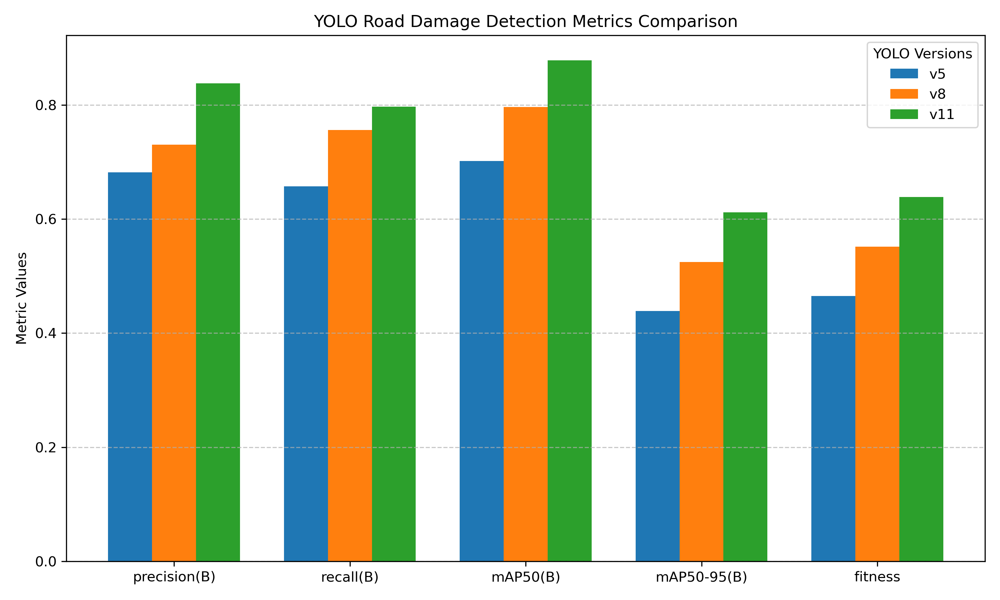

## Dataset

The Road Damage Dataset 2022 (RDD2022; [Arya et al., 2021](https://www.researchgate.net/publication/363668453_RDD2022_A_multi-national_image_dataset_for_automatic_Road_Damage_Detection)) was employed to evaluate our model's performance. While the complete dataset contains images from six countries, we specifically utilized the United States subset, which comprises 4,805 images collected via Google Street View. These images were captured across various locations including California, Massachusetts, and New York at a resolution of 640×640 pixels. Sample images from the U.S. dataset are shown in Figure 1.

The dataset categorizes road damage into four distinct types as shown in Table 1:

Table 1
Road Damage Categories in RDD2022

| Damage Type          | Class Name | Count |
|----------------------|------------|-------|
| Longitudinal Cracks  | D00        | 6750  |
| Transverse Cracks    | D10        | 3295  |
| Alligator Cracks     | D20        | 834   |
| Potholes             | D40        | 135   |

For our experimental setup, we divided the U.S. dataset using an 80-20 split ratio, resulting in 3,844 images for training and 9,61 images for testing. The distribution of damage instances in the training set demonstrates a notable imbalance, with longitudinal cracks being the most prevalent (6,750 instances), followed by transverse cracks (3,295 instances), alligator cracks (834 instances), and potholes (135 instances), totaling 11,014 annotated damage instances.

All images in the dataset are annotated following the PASCAL VOC format, which provides bounding box coordinates and damage type classifications. This standardized annotation format makes the dataset particularly suitable for object detection tasks and enables direct comparison with various detection models.

*Figure 1: Examples of Different Road Damage Types from the U.S. Dataset. Representative Google Street View images showing the four categories of road damage: longitudinal cracks (D00, top row), transverse cracks (D10, second row), alligator cracks (D20, third row), and potholes (D40, bottom row). Red bounding boxes indicate the locations of damage with corresponding labels. All images were captured at 640×640 pixel resolution.*

## Model and Evaluation Metrics

This study employs three versions of the YOLO (You Only Look Once) object detection model: [YOLOv5](https://docs.ultralytics.com/models/yolov5/), [YOLOv8](https://docs.ultralytics.com/models/yolov8/), and [YOLO11](https://docs.ultralytics.com/models/yolo11/). These models represent the evolution of the YOLO architecture, with each version introducing improvements in detection accuracy and computational efficiency. YOLOv5 established a strong baseline for real-time object detection, while YOLOv8 introduced significant architectural improvements including a deeper backbone network and enhanced feature aggregation. YOLO11, the most recent iteration, further refined these capabilities with advanced training techniques and architectural optimizations.

To evaluate and compare the performance of these models, we selected five standard metrics commonly used in object detection tasks:

1. **Precision** measures the proportion of correct positive predictions among all positive predictions made by the model. In the context of road damage detection, this indicates how many of the detected damages are actual damages.

2. **Recall** quantifies the proportion of actual positive cases that were correctly identified. This metric is particularly important for road maintenance as it reflects the model's ability to identify all instances of road damage, where missing critical damage could have serious consequences.

3. **mAP50** (mean Average Precision at IoU=0.50) represents the mean average precision when considering a prediction correct if it has at least 50% overlap with the ground truth bounding box. This metric provides a balanced assessment of both localization and classification accuracy.

4. **mAP50-95** extends the mAP evaluation by averaging the mAP values across different IoU thresholds from 0.50 to 0.95, offering a more comprehensive evaluation of detection quality across various degrees of localization precision. This is particularly relevant for road damage detection where accurate damage boundary identification can be crucial for maintenance planning.

5. **Fitness** score combines multiple performance metrics into a single value, calculated as a weighted average of key metrics. We include this metric to provide a holistic view of model performance, helping to balance the trade-offs between different aspects of detection quality.

## Results

The comparative performance analysis of YOLOv5, YOLOv8, and YOLO11 on the U.S. subset of RDD2022 revealed a consistent pattern of improvement across model versions, as shown in Figure 2 and detailed in Table 2.

YOLO11 demonstrated superior performance across all evaluation metrics, achieving the highest scores in precision (0.8383), recall (0.7970), mAP50 (0.8782), mAP50-95 (0.6119), and overall fitness (0.6385). This represents substantial improvements over its predecessors, with approximately a 15% increase in precision and a 14% increase in mAP50 compared to YOLOv5.

YOLOv8 showed intermediate performance levels, marking significant improvements over YOLOv5 while not quite reaching the benchmarks set by YOLO11. Notably, YOLOv8 achieved considerable gains in recall (0.7564) and mAP50 (0.7967), representing improvements of approximately 10% over YOLOv5 in these metrics.

YOLOv5, while showing competitive baseline performance, particularly in mAP50 (0.7016), demonstrated lower scores across all metrics compared to its newer iterations. The most significant performance gaps were observed in mAP50-95 (0.4389) and fitness (0.4652), suggesting particular room for improvement in precise localization tasks.

*Figure 2: Performance Comparison of YOLO Versions Across Different Metrics. Bar graph comparing the performance metrics of YOLOv5, YOLOv8, and YOLO11 on the U.S. road damage dataset. Metrics include precision, recall, mAP50, mAP50-95, and fitness scores. All metrics are reported on a scale from 0 to 1, with higher values indicating better performance. The consistent height increase from v5 (blue) to v8 (orange) to v11 (green) demonstrates the progressive improvement across model versions.*

Table 2
Detailed Performance Metrics for Different YOLO Versions
| YOLO Version | Precision (B) | Recall (B) | mAP50 (B) | mAP50-95 (B) | Fitness |
|--------------|---------------|------------|-----------|--------------|---------|
| v5           | 0.6822        | 0.6576     | 0.7016    | 0.4389       | 0.4652  |
| v8           | 0.7306        | 0.7564     | 0.7967    | 0.5246       | 0.5518  |
| v11          | **0.8383**        | **0.7970**     | **0.8782**    | **0.6119**       | **0.6385**  |

## Model Efficiency

A comprehensive analysis of computational efficiency was conducted across all three YOLO versions, considering model size, inference speed, and training characteristics. Table 3 presents the detailed efficiency metrics for each model variant.

Table 3
Computational Efficiency Metrics for YOLO Models

| Model Version | Image Size | CPU Speed (ms) | GPU Speed (ms) | Parameters (M) | FLOPs (B) | Training Time per Epoch (s) |
|--------------|------------|----------------|----------------|----------------|-----------|---------------------------|
| YOLOv5s      | 640        | 120.7          | 1.27           | 9.1            | 24.0      | 62                       |
| YOLOv8s      | 640        | 128.4          | 1.20           | 11.2           | 28.6      | 65                       |
| YOLO11s    | 640        | 90.0      | 2.5       | 9.4            | 21.5      | 55                       |

In terms of model architecture, all three versions maintained a consistent input resolution of 640×640 pixels. YOLO11 demonstrated the most efficient CPU inference time at 90.0 ms, approximately 25% faster than both YOLOv5 (120.7 ms) and YOLOv8 (128.4 ms). However, when tested on an NVIDIA A100 GPU with TensorRT optimization, YOLOv8 achieved the fastest inference at 1.20 ms, followed closely by YOLOv5 at 1.27 ms, while YOLO11 required 2.5 ms.

Regarding model complexity, YOLOv8 had the largest parameter count at 11.2M and the highest computational demands at 28.6B FLOPs. In contrast, YOLO11 maintained a more balanced profile with 9.4M parameters and the lowest FLOPs count of 21.5B, while YOLOv5 showed similar efficiency with 9.1M parameters and 24.0B FLOPs.

Training efficiency was evaluated using a batch size of 16 across 100 epochs for all models. YOLO11 demonstrated the fastest training speed at approximately 55 seconds per epoch. YOLOv5 and YOLOv8 required approximately 62 and 65 seconds per epoch, respectively, resulting in total training times of about 1.7 hours for YOLOv5, 1.8 hours for YOLOv8, and 1.5 hours for YOLO11.
